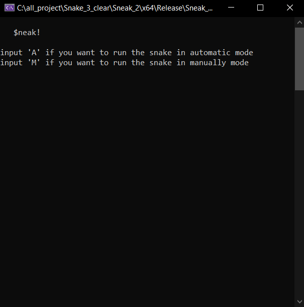
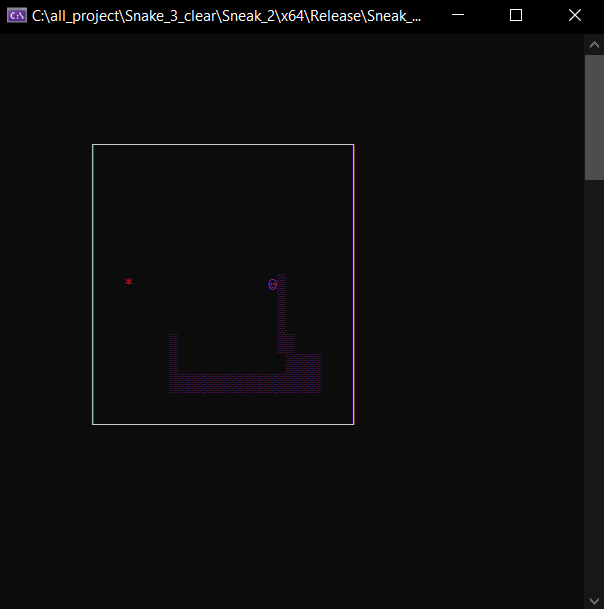
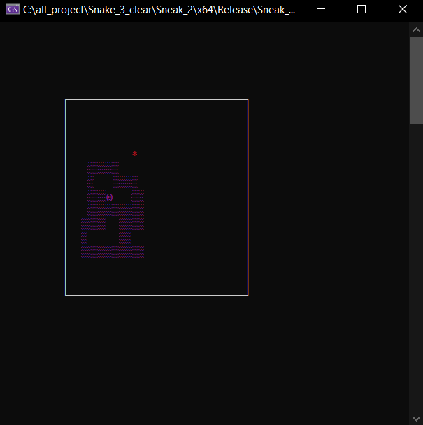
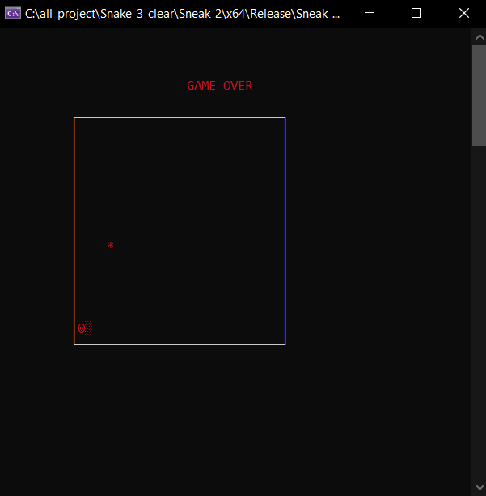

# Змейка v2: текстовая версия

## Описание
Этот проект представляет собой реализацию классической игры "Змейка" на языке программирования C++. Игра создана в текстовом режиме c поддержкой разных базовых цветов. 

Данная версия это логическое продолжение первой версии этой игры от меня. Логика игры постренна на основе классов, таких как apple, snake, map. Также применены некоторые другие паттерны разработки.

Хоть данная версия значительно лучше первой версии, она использует очень много "плохих" приемов, таких как глобальные переменые, friend class, "волшебные числа" и прочее.

Также данная версия имеет автоматичский режим поиска пути, сделано это ОЧЕНЬ СЛОЖНО, то есть без использования алгоритма BFS огронмыми 6 вложеными циклами и огромным количеством if else конструкций(сама функиц я поиска пути занимает 700 строк, СЕМЬСОТ СТРОК, тогда мне казалась это хорошей идеей...)

## Функционал
- Змейка может перемещаться по игровому полю, собирая еду и увеличивая свою длину.
- При попадании в стену или саму себя игра завершается.
- Автоматический режим по постройки пути БЕЗ ИСПОЛЬЗОВАНИЯ ГРАФОВ

## История
Это мой самый первый проект, который сложнее "Хелоу ворлд" like программ. Сейчас когда я смотрю на это, мне болно, глазам особенно. Это был прекраснный учебный проект!

## Скриншоты

